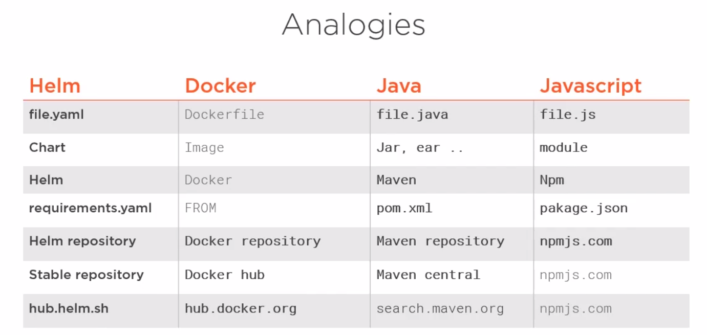

# HELM POC
Learning example with Helm, to understand tool as well as provide working example.  Utilized [Packaging Applications with Helm for Kubernetes
by Philippe Collignon course from pluralsight](https://app.pluralsight.com/library/courses/packaging-applications-helm-kubernetes/table-of-contents) as a guide.

## What is Helm and Whats in it for me?
Package manager for kubernetes (k8s)
* Allow easier abstraction for setting up k8s apps (set values to be used in multiple places - easier maintenance)
* Allow setting up complex hierarchy of k8s apps 
* Think about setting up a wordpress service + mariadb on a k8s cluster in one minute from scratch.

### Helm & Tiller
Helm 2.0 and 3.0 have some larger changes.  In helm 2.0 you need to install the service agent (TILLER) on the k8s cluster. Helm 3.0 doesn't need it.
* Helm = client tool
* Tiller = agent installed in cluster
---
## Required Software and Setup
1. Have k8s cluster set up (or minikube locally)
1. Have kubectl configured to access k8s cluster
1. [Have helm installed](https://helm.sh/docs/intro/quickstart/)
1. Have helm repo connection set up

---
## Quick start installing a chart and checking it installed
1. start up minikube
`minikube start`
1. set up helm repository 
`helm repo add stable https://kubernetes-charts.storage.googleapis.com/`
1. pull down chart and create a helm chart for nginx
`helm create nginx-demo`
1. install the application with  (using generate name, could specify name if desired)
`helm install nginx-demo --generate-name`
1. confirm item is installed 
`kubectl get all | grep nginx-demo`
--- 
## Setting up Security
If you want to go to production you should restrict the rights to a given namespace. (if using helm 2.0 securing tiller may be needed, with helm 3.0 secuity may be different since helm 3.0 will not utilize tiller).  This section has to do with creating namespaces and associating them with roles and binding accounts to roles.

### Setting up tiller permissions for helm 2.0 with service id
1. Create namespace e.g. lab
`kubectl create namespace lab`
1. Create service account `kubectl create -f ./lab-serviceaccount/tiller-serviceaccount.yaml`
1. Create role `kubectl create -f ./lab-serviceaccount/example-role.yaml`
1. Create the role binding `kubectl create -f ./lab-serviceaccount/exampleaccount-rolebinding.yaml`
1. Initialize helm with service account and namespace`helm init --service-account tiller --tiller-namespace lab`
1. Check namespace `kubectl get all --namespace=lab`
1. Check with a test chart, first create test chart `helm create test`
1. Install test chart in namespace (expect to install without issue) `helm install test --tiller-namespace=lab`
1. Test installing test chart to different namespace `helm install test --tiller-namespace=lab --namespace=default` (expect forbidden error)

---
## Cleaning Helm
As you use it more and more you may need to clean out tiller or your local helm repo.  Below are som helpful commands. 
### Deleteing release
1. list out releases `helm list`
1. delete specific release `helm delete test-1576337481` (all objects related to release)

### Keeping history clean / Limit History
* Deleting tiller config (depending on if you have config maps as well can call helm 2.x) `helm delete test-1576337481 --purge`
* Limiting tiller config (if lots of release updates tiller can get overwhelmed, you can limit history) `helm init --history-max 200` (helm 2.x)
* Deleting tiller (on server) `helm reset`
* Deleting helm local files `rm -rf /home/me/.helm` and the local helm binary `rm /usr/local/bin/helm`

---
## Creating a release
Its easy to create a release or helm chart with multiple items see [guestbook](./guestbook)  
1. Create folder of your release (e.g. guestbook)
1. Create Chart.yaml to define chart to be run and its version
1. Create templates folder
1. Create yaml files under template of the items you would want created
    * frontend
    * ingress
    * service
    * etc...
1. Move back to one directory about the target directory (e.g. guestbook)1. Run install `helm install guestbook --generate-name`
1. Can check pods with `kubectl get pod -l app=frontend`
1. Can check releases `helm list`

### Release vs Release Revision
A release is a particular deploy of one or more components to cluster with versions tied to them. A release revision is just updating the specific release with possible a different version of one or more of the components.  Don't create new releases of the same components, make a release once then upgrade the release revision when one or more of its components are updated.
1. Go to the specific chart folder
1. Increment the component (e.g. frontend 1.0 -> 1.1)
1. Run `helm upgrade guestbook`
1. Can rollback with `helm roleback guestbook 1` (name of release and revision number)
1. Can see release history with `helm history guestbook`
1. Deleting release `helm delete guestbook --purge`
---
## Umbrella Chart
When you have muliple components in your application you can define them with an umbrella chart. Think "Chart of Charts", Instead of one component at a time with its service/ingress/configmap etc, do multiple ones.

---

## Helm Template
Template is just charts with externalized configurations by way of with directives ( similar to variables, but variables keyword used to describe temp or local variable item inside chart in helm) placeholders that you can abstract values out of. 

1. Seperate out duplication of values of chart more easily to allow devops to change names, versions, configs in one place
1. Allows to have multiple types of value.yamls to reference, or use for different versions, environments.
1. Can test templates without actually installing `helm install --dry-run --debug` or using `helm lint`
1. Can either pass values to directives by 
    1. values from yaml file `helm install -f file`
    1. inline helm command `helm install --set foo=bar`
1. Additional logic in directives to make them flexible (e.g. functions / modify scope "with", controll whitespace, logic operators, flow control and loops, sub-templates). Most functionality comes from go templates and sprig
1. You can scope templates to use a specific value with with keyword `{{ with .Value. service }}`, now other directives will use this as a base e.g. `{{ .port }}` until you end the scope `{{ end }}`
1. Sometimes template whitespace gets weird so if you add a - to the directive it will clear up odd carrige returns `{{ - with .Values.service }}`
1. Sometimes when you need to dynamically alter the template (e.g. add a new yaml property in the template instead of just property values) you can use indent to properly space the directive so it is linted as an item `{{ indent 6 .Value tcp }}`
1. Logic operator exist in helm charts as functions (e.g. and, or, not, if) `{{- if and .adminEmail (or .serviceAccountJson .existingSecret)}}` a lot of time this is to control flow
1. When you use scope sometimes you can't access the item you need, so you can set a variable before the scope set and then call the variable from within the new template scope. 
1. When you have a large amount of logic in a directive, you can abstract it into a helper function or sub template and put it in a _helpers.tpl file.
---
## Managin Dependencies and Creating Charts
To move chart to repo you have to package it, its a tar.gz.  Use `helm package chart_name` not tar, it names and versions it for you. 

### Creating packages
Similar to nuget / maven it saves a chart locally to a local repo as well as connects to a remote repo. 
1. Navigate to the direcory that holds the charts
1. Package up your charts `helm package frontend backend database`
1. Create an index.yaml file for your charts `helm repo index .`

### Managing dependencies
You can add charts in the charts file (long hand method), or you can put dependencies in the requirements.yaml file in the root of the chart. 

1. In the requirements file you can specify a range of different versions with 
    1. ~1.2.3 (>= 1.2.3, < 1.3.9) 
    1. ^1.2.3 (>= 1.2.3 < 2.0.0)
    1. 1.2 - 1.4.5 (>= 1.2, <= 1.4.5)
1. When you download dependencies, it may get new versions of dependencies `helm dependency update guestbook`, you can see these versions in `helm dependency list guestbook`.  It makes the requirements.lock file with the dependency versions.
1. If you want to install the charts again but not update a new version you can run `helm dependency build guestbook`.  It will build from requirements.lock not the requirements.yaml file. 
1. The requirements.yaml can pull values off values.yaml.  requirements can have conditions of it the dependency needs to be filled or not. (e.g. pull boolean from values
1. Can use tags in the requirements to group components (e.g. database and backend) and then bucket them together. 

### Using Existing Charts
1. See repo lists `helm repo list`
1. Search for what you need `helm search keyword`
1. Look up info about chart `helm inspect chart_name` 
1. Download a specific chart (without dependencies) `helm fetch chart_name`

### Customize Existing Charts
1. You want to use a generic existnig chart from hub but need to customize some setting.  You can override value in requirements.yaml 